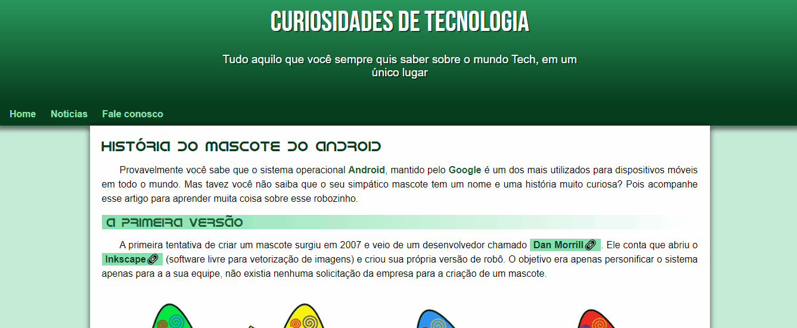

<<<<<<< HEAD
# História Android
Meu primeiro projeto após fazer o curso de HTML e CSS do Curso em vídeo - Prof. Gustavo Guanabara

## Tecnologias utilizadas:

- HTML
- CSS
=======
# historia-android
Repositório história andoid
>>>>>>> 14135cf169c520fa0e994df6aa25de7d8c081db0
